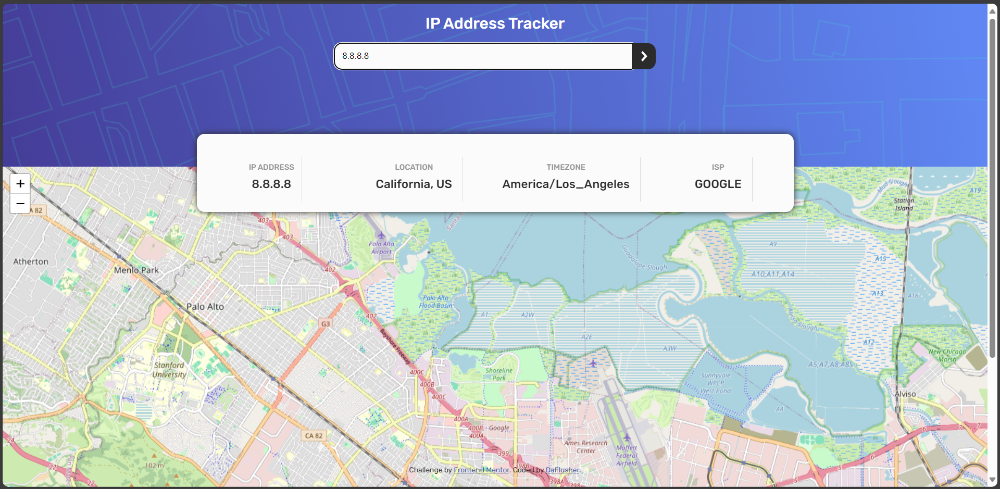

# Frontend Mentor - IP address tracker solution

This is a solution to the [IP address tracker challenge on Frontend Mentor](https://www.frontendmentor.io/challenges/ip-address-tracker-I8-0yYAH0). Frontend Mentor challenges help you improve your coding skills by building realistic projects. 

## Table of contents

- [Overview](#overview)
  - [The challenge](#the-challenge)
  - [Screenshot](#screenshot)
  - [Links](#links)
- [My process](#my-process)
  - [Built with](#built-with)
  - [What I learned](#what-i-learned)
  - [Continued development](#continued-development)
  - [Useful resources](#useful-resources)
- [Author](#author)

## Overview

### The challenge

Users should be able to:

- View the optimal layout for each page depending on their device's screen size
- See hover states for all interactive elements on the page
- See their own IP address on the map on the initial page load
- Search for any IP addresses or domains and see the key information and location

### Screenshot

### Links

- Solution URL: [Add solution URL here](https://your-solution-url.com)
- Live Site URL: [Add live site URL here](https://fem-ip-address-tracker-r8j5.vercel.app/)

## My process

### Built with

- Semantic HTML5 markup
- Flexbox
- CSS Grid
- Mobile-first workflow

### What I learned
This project helped me consolidify my knowledge of writing async Js. It was interesting to interact with several APIs, in my search for the right fit.

### Continued development

Migrating to the paid plan of any of the geolocation API. Current access is limited to 1000 requests/day for ipapi.co

### Useful resources

- [Geoipify](https://geo.ipify.org/) - Geolocation Generator site
- [Ipapi API site](https://ipapi.co) - Geolocation generator API site
- [Leaflets JS](https://leafletjs.com/) - Map Generator site

## Author

- Website - [Joy Ibe](https://www.joy-ibe-daflusher.vercel.app)
- Frontend Mentor - [@yourusername](https://www.frontendmentor.io/profile/DaFlusher)
- Twitter - [@yourusername](https://www.twitter.com/@Joyibe17)